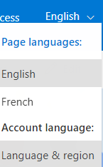
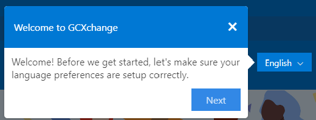
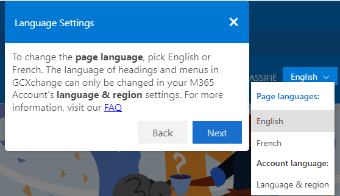
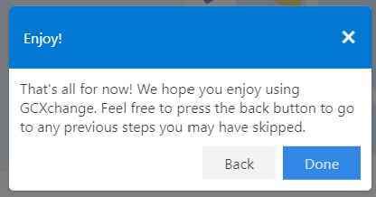

# Extend Language Extension

## Summary

Extend language select to add link to account language settings.

Language toggles on Hub sites will be automatically be targeted by this extension. To target sub-sites of a hub site that also has language toggles, change the siteIds values in the extension properties. This extension is intended to be deployed tenant wide. When a user visit first time to the site, a tour about the extension will be displayed.

This extention pulls values from the extension properties defined on SharePoint. When deployed there are already some default values provided. You can edit these from the app catalog's tenant wide section. The properties follow JSON formatting, and each property is a string that needs to start and end in double quotations. The property used in this extension is siteIds that is a list of comma separeated GUIDs that represent the site Ids that this extension will be applied to (other than hub sites)

#### Language Toggle

#### Tour

## Prerequisites
None
## API permission
Microsoft Graph - User.ReadBasic.All
## Version 

## Applies to

- [SharePoint Framework](https://aka.ms/spfx)
- [Microsoft 365 tenant](https://docs.microsoft.com/en-us/sharepoint/dev/spfx/set-up-your-developer-tenant)

> Get your own free development tenant by subscribing to [Microsoft 365 developer program](http://aka.ms/o365devprogram)

## Version history

Version|Date|Comments
-------|----|--------
1.0|Sept 24, 2021|Initial release
1.0.1  | Jun 29, 2022 | Siteids added as extension property
1.0.2  | Sept 23, 2023 | Upgraded to SPFX 1.17.4

## Minimal Path to Awesome
- Clone this repository
- Ensure that you are at the solution folder
- Ensure the current version of the Node.js (16.3+)
  - **in the command-line run:**
    - **npm install**
- To debug
  - go to the `spfx-extendlang\config\serve.json` file and update `pageUrl` to any url of hubsite
  - **in the command-line run:**
    - **gulp clean**
    - **gulp serve**
- To deploy: 
  - **in the command-line run:**
    - **gulp clean**
    - **gulp bundle --ship**
    - **gulp package-solution --ship**

- Upload the extension from `\sharepoint\solution` to your tenant app store

## Disclaimer

**THIS CODE IS PROVIDED *AS IS* WITHOUT WARRANTY OF ANY KIND, EITHER EXPRESS OR IMPLIED, INCLUDING ANY IMPLIED WARRANTIES OF FITNESS FOR A PARTICULAR PURPOSE, MERCHANTABILITY, OR NON-INFRINGEMENT.**